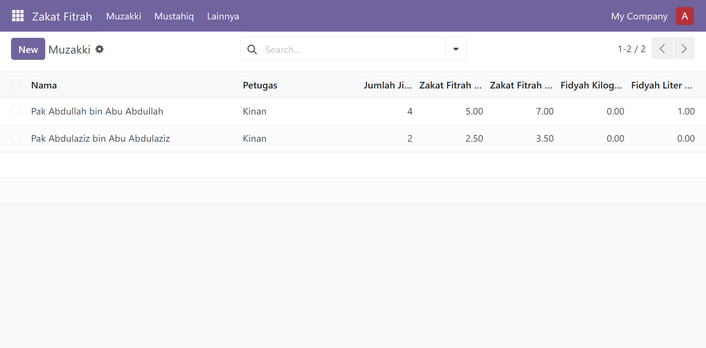
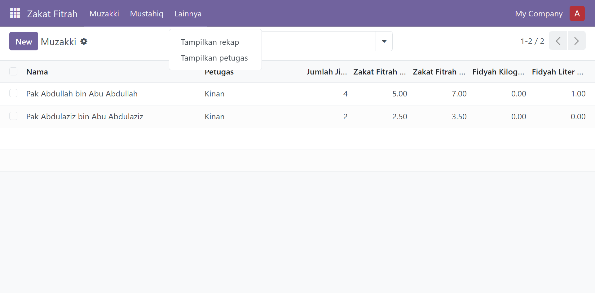
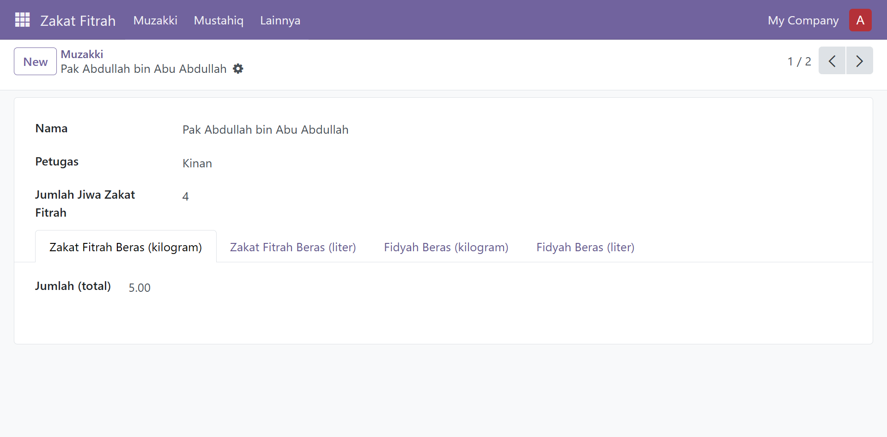
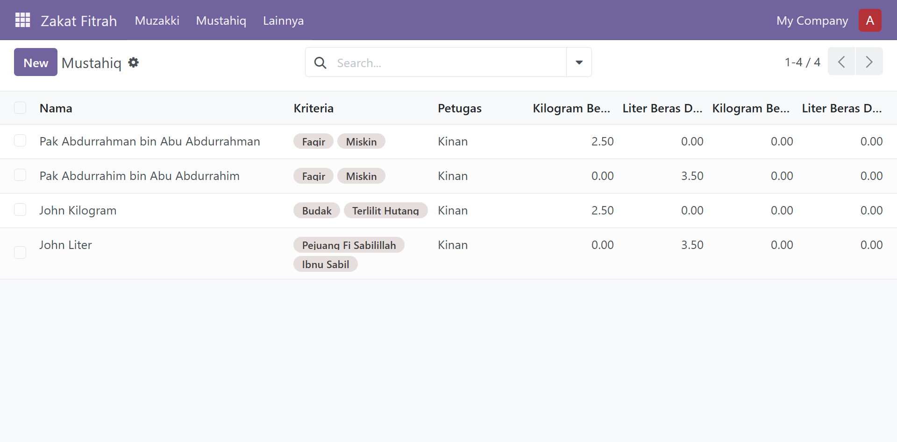
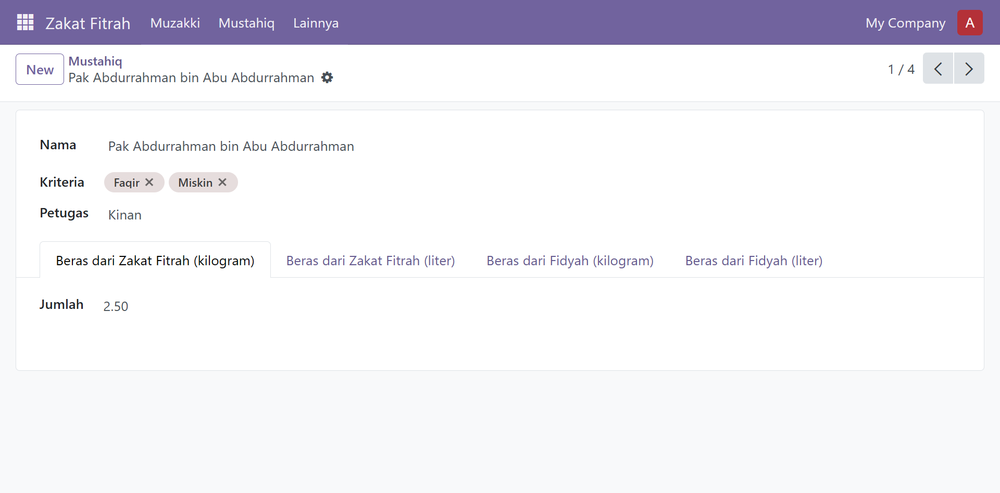
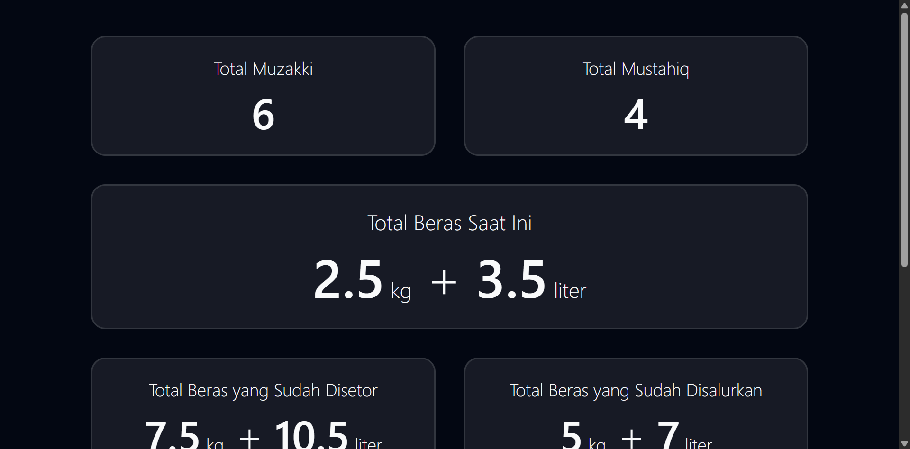
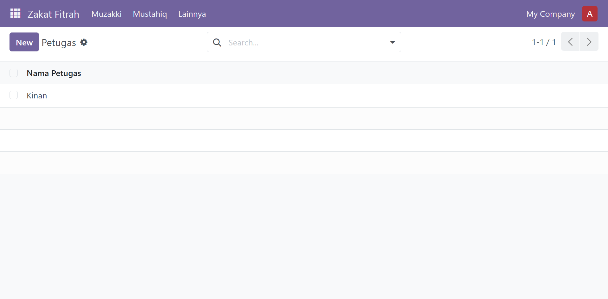
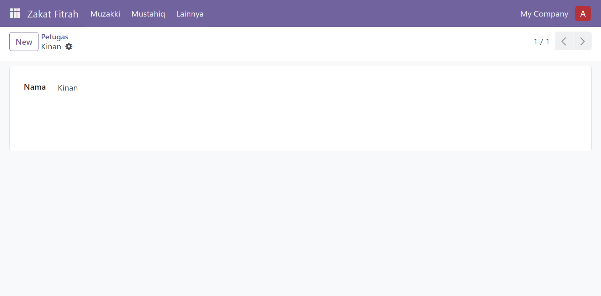
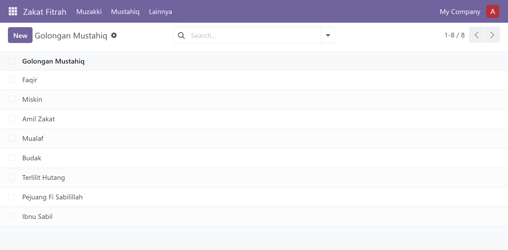
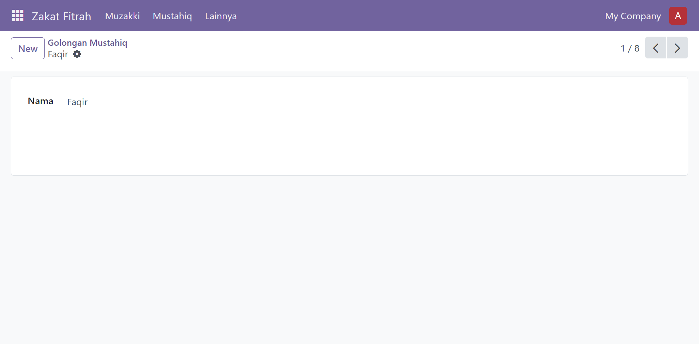

# `odoo-zakat-fitrah-app`
Aplikasi (module) Odoo sederhana untuk pendataan sederhana untuk case panitia (atau amil) zakat fitrah sederhana.

## Overview

- ### Halaman awal

- ### Menu

- ### List muzakki

- ### Form muzakki

- ### List mustahiq

- ### Form mustahiq

- ### Rekap

- ### List petugas (panitia)

- ### Form petugas (panitia)

- ### List golongan mustahiq

- ### Form golongan mustahiq

---

- Versi Odoo: 18